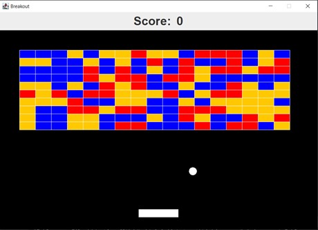

# 1.1 Breakout Game Clone Overview

**Overview written by Peter Mitchell.**

## Contents

```
1.1 Breakout Game Clone Overview ............................................................................................. 1
1.2 Introduction ............................................................................................................................ 1
1.3 The Rules of Breakout ............................................................................................................. 1
1.4 High Level Discussion About Implementation ........................................................................ 2
1.5 How the Core Game Works .................................................................................................... 3
1.6 Features You Could Add .......................................................................................................... 4
```
# 1.2 Introduction

This document will explain the fundamentals of how the Breakout game works. 

# 1.3 The Rules of Breakout

The rules of the game breakout can be summarised as seen below.

- The player controls a paddle used to hit a bouncing ball.
- The ball will bounce off walls, the paddle, and bricks.
- Bricks when hit will either be destroyed or reduce their durability to be destroyed on
    subsequent hits (unless they are indestructible).
- Score is awarded for each brick that is successfully destroyed.
- The game ends when the ball either hits the bottom of the screen (meaning the player has
    failed to block the ball) resulting in a loss, or when all the bricks have been destroyed resulting
    in a win.


# 1.4 High Level Discussion About Implementation

The game starts with a view like the image below. The current score is shown at the top, the player’s
paddle is represented by the white bar at the bottom. The ball is shown as the circular ball that
spawned just above the paddle and started moving up at a random angle. The bricks are in a
randomised grid. With each brick representing how many hits it takes to destroy based on the colour.



The blue bricks take 3 hits to destroy, orange bricks take 2 hits, and red take one hit. Each time bricks
are hit the colour will change to show how many hits remain. You can see an example below showing
some of the bricks already destroyed from the ball bouncing between them.


 

Above you can see the two possible end game states. On the left you can see all the bricks have been
destroyed causing the game to end with a win. And on the right the ball has hit the bottom of the
screen. This results in a game over as has been shown.

# 1.5 How the Core Game Works

This section will just briefly discuss what each of the classes are for. For full details you can review the
comments in each class that are provided for the methods, variables, and class itself.

General classes:

- Position: Used to represent an X and Y coordinate.
- Rectangle: Used to represent a rectangle space with X and Y coordinate, width, and height.
    Can be used to check for collisions with bricks.

Interface classes:

- Game: Creates the JFrame and manages the GamePanel/ScorePanel.
- GamePanel: Controls all the game elements are draws the current state of the game.
- ScorePanel: Shows a simple score at the top of the screen.

Game specific classes:

- Ball: Represents a bouncing ball that can collide with the walls, bricks, and the player’s paddle.
- Brick: A brick that can have different types to determine how many hits are required to destroy
    it. This is colour coded.
- BrickManager: Controls the status of all bricks. Will remove bricks once they have been
    destroyed and provides functions to populate the game with bricks.
- Paddle: The player’s paddle that can be controlled with the left/right arrow keys.


# 1.6 Features You Could Add

There are many features you could add to improve the game. The following list summarises some
options to try implementing on top of the base game.

- Modify the way the ball moves when it hits the paddle. Instead of just reflecting on the Y axis
    you could based on where the paddle is hit change the angle of motion. So that it will move
    at different angles to add skill to making it move where you want.
- Create a proper map of bricks instead of filling it with random ones.
- Create multiple levels. Make the game transition to the different levels after each level is
    complete instead of moving to the game won overlay.
- Make the game more visually appealing, particularly regarding how the score is shown.
- Consider adding other types of bricks that have special functions. For example, you could
    speed up the ball for a short time, make them explode in a radius, or have them modify other
    bricks around them in some special way.
- Consider how having additional balls may impact the game. You could add in multiple balls
    that appear under some special condition. You will need to consider how this impacts the end
    game condition.
- Consider adding additional paddles. You could add paddles to all the sides and make all sides
    a trigger to end the game.
- Look at features that have been implemented in other people’s Breakout games and try to
    implement them in this one.
- Come up with your own unique features and try to implement them.


